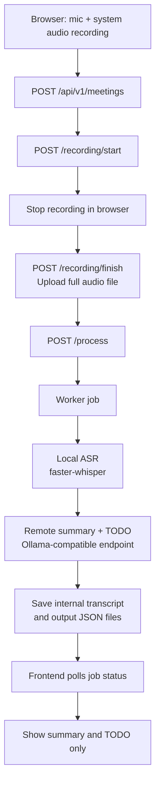

# Meeting Notes App

Browser-based meeting recorder for post-meeting processing.

This project records microphone + shared system audio from the web UI, uploads the final audio file when recording stops, runs local ASR with `faster-whisper`, then sends the transcript to a remote Ollama-compatible model for `summary` and `TODO` generation.

The frontend only shows the final summary and TODO list. Internal transcript and audio files are kept for retention/processing purposes and are not exposed in the UI.

## Features

- Browser recording only, no separate upload entry flow
- Microphone + system audio mixed in the browser before upload
- Non-realtime workflow: record first, process after the meeting ends
- Local ASR with `faster-whisper`
- Remote summarization and TODO extraction through an Ollama-compatible endpoint
- Background job processing with polling-based result retrieval
- Internal transcript retention without showing transcript content in the frontend

## Architecture

| Component | Role |
| --- | --- |
| `web` | Next.js frontend on port `3000` |
| `api` | FastAPI backend on port `8000` |
| `worker` | Background processing for ASR and summarization |
| `redis` | Job queue and status store |

## Workflow



## Current Scope

- No realtime subtitle
- No Zoom or Google Meet integration
- No slide or screen-content understanding
- No transcript view in the frontend
- TODO items only contain task text in the current version

## Recording Requirements

System audio capture currently targets desktop Chrome or Edge.

Recording flow:

1. Click `開始錄音`
2. Grant microphone access
3. Choose a screen, window, or tab
4. Make sure audio sharing is enabled in the browser share dialog
5. Click `停止錄音` when the meeting ends
6. Wait for upload and background processing

Expected behavior:

- Recording does not start unless both microphone and shared audio are available
- If shared audio ends during recording, the app stops the recording automatically
- The frontend polls job status until the result is ready

## Getting Started

### 1. Create `.env`

```bash
cp .env.example .env
```

### 2. Start the stack

```bash
make up
```

### 3. Check health

```bash
make smoke
```

### 4. Open the app

- [http://localhost:3000](http://localhost:3000)

## Configuration

This project is currently designed for:

- local `faster-whisper` transcription
- remote Ollama-compatible summarization

Default runtime values:

| Variable | Default |
| --- | --- |
| `WHISPER_MODEL_SIZE` | `small` |
| `WHISPER_DEVICE` | `cpu` |
| `WHISPER_COMPUTE_TYPE` | `int8` |
| `OLLAMA_BASE_URL` | `http://remote-host:11434/api/chat` |
| `OLLAMA_MODEL` | `qwen3:14b` |
| `SUMMARY_CHUNK_CHARS` | `6000` |

Notes:

- The first run downloads Whisper weights, so initial processing is slower
- `small + cpu + int8` is the conservative default for a laptop or CPU-only Docker setup
- Long transcripts are chunked before summarization
- `OLLAMA_BASE_URL` supports both a base URL like `http://host:11434` and a full endpoint like `http://host:11434/api/chat`

## API

### Meetings

- `POST /api/v1/meetings`
- `POST /api/v1/meetings/{meeting_id}/recording/start`
- `POST /api/v1/meetings/{meeting_id}/recording/finish`
- `POST /api/v1/meetings/{meeting_id}/process`
- `GET /api/v1/meetings/{meeting_id}/result`

### Jobs

- `GET /api/v1/jobs/{job_id}`

### Todos

- `PATCH /api/v1/meetings/{meeting_id}/todos/{todo_id}`

`POST /api/v1/meetings/{meeting_id}/recording/finish` uses `multipart/form-data` with field name `file`.

## Storage Layout

Meeting data is stored under:

`data/meetings/<meeting_id>/`

Files:

- `metadata.json`
- `audio/*`
- `intermediate/intermediate_transcript.jsonl`
- `output/summary.json`
- `output/todos.json`

The frontend only reads `summary.json` and `todos.json` through the API.

## Retention

- The worker clears `audio/` and `intermediate/` for meetings older than `RETENTION_DAYS`
- Default retention is `30` days
- Cleanup runs periodically inside the worker loop

## Troubleshooting

### Docker daemon is not running

- Start Docker Desktop
- Run `make up` again

### API health is degraded

- Check `make logs`
- Verify Redis is running
- If `ollama_ok=false`, check `OLLAMA_BASE_URL` reachability

### No summary is generated

- Confirm `worker` is running
- Inspect `make logs`
- Verify `OLLAMA_BASE_URL` and `OLLAMA_MODEL`

### Recording cannot start

- Use desktop Chrome or Edge
- Re-open the share dialog and enable audio sharing
- Confirm microphone permission is granted

### Local transcription is too slow

- Try `WHISPER_MODEL_SIZE=base`
- Keep `WHISPER_DEVICE=cpu` and `WHISPER_COMPUTE_TYPE=int8` for CPU-only machines

## Development Notes

- Python dependencies are managed with `uv`
- The API package definition lives in [`/Users/chenqien/Documents/會議記錄應用/api/pyproject.toml`](/Users/chenqien/Documents/會議記錄應用/api/pyproject.toml)
- Docker Compose is the default local runtime
